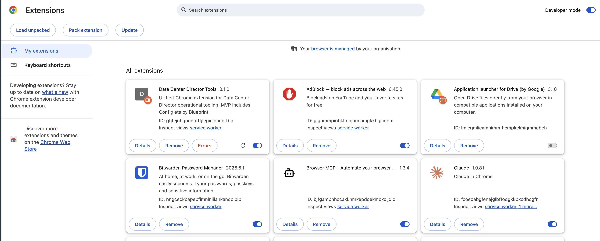
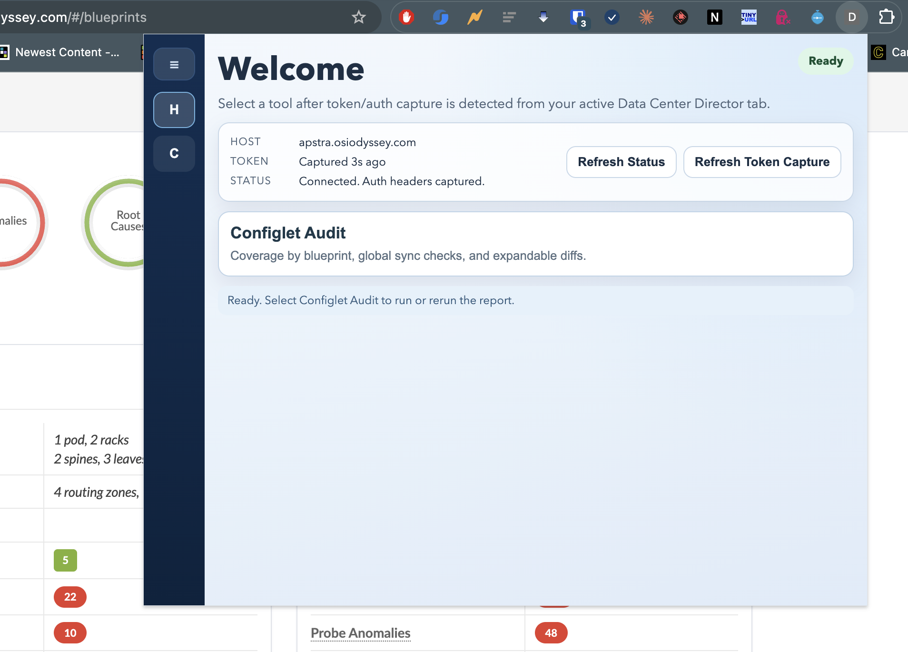
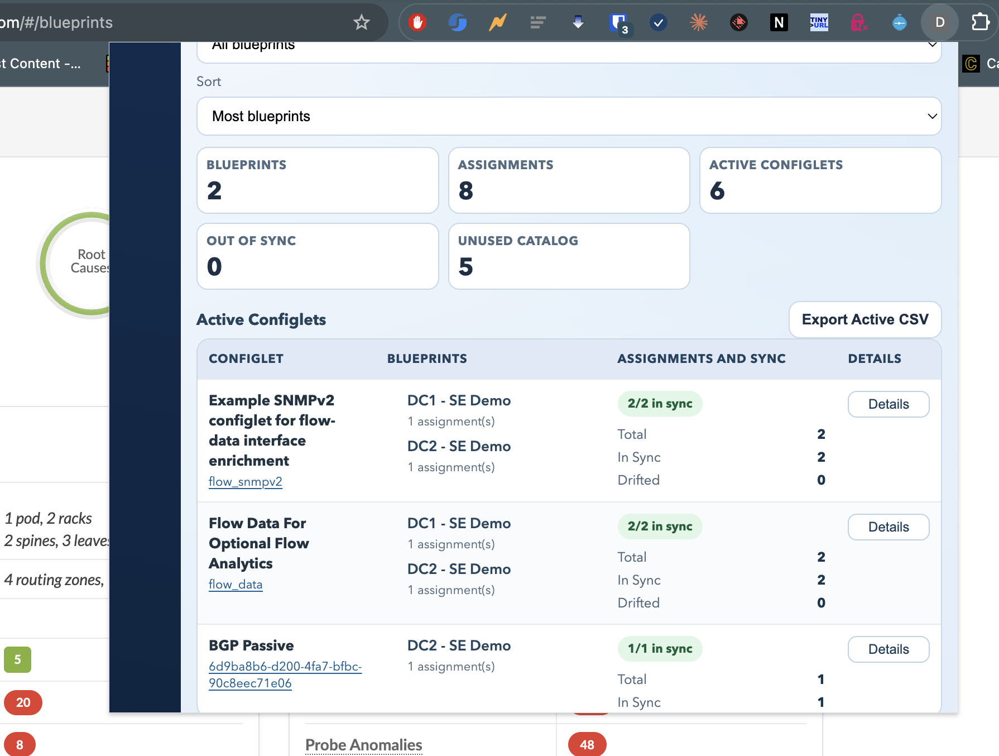
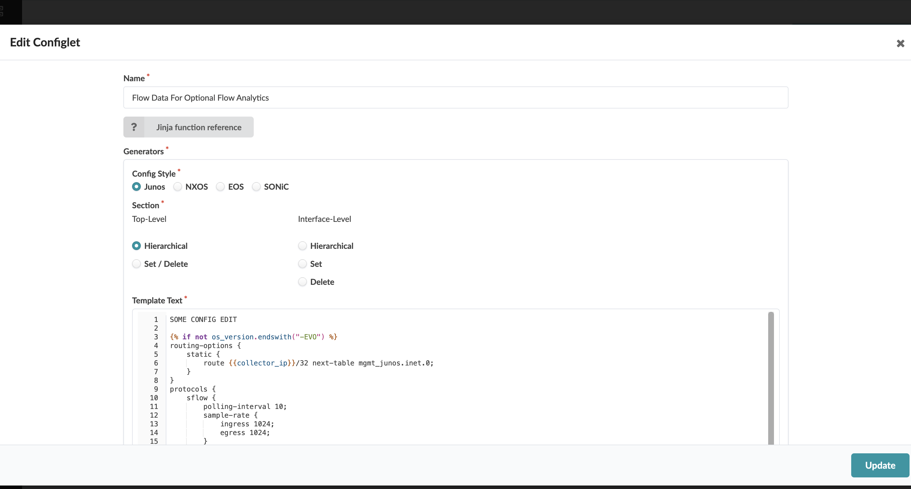
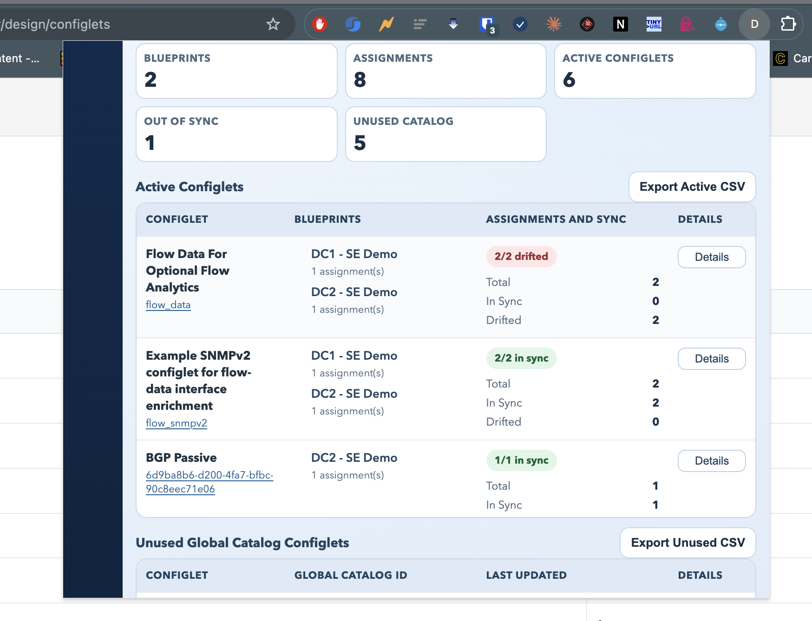
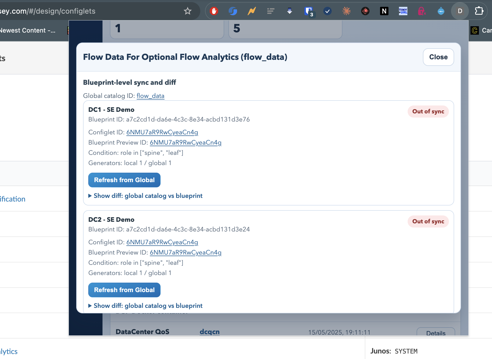
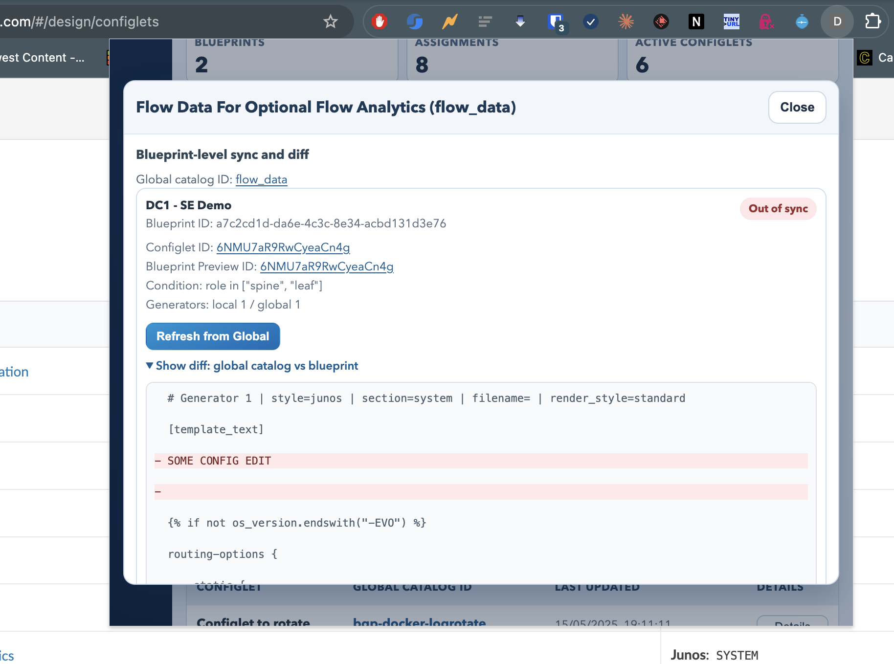
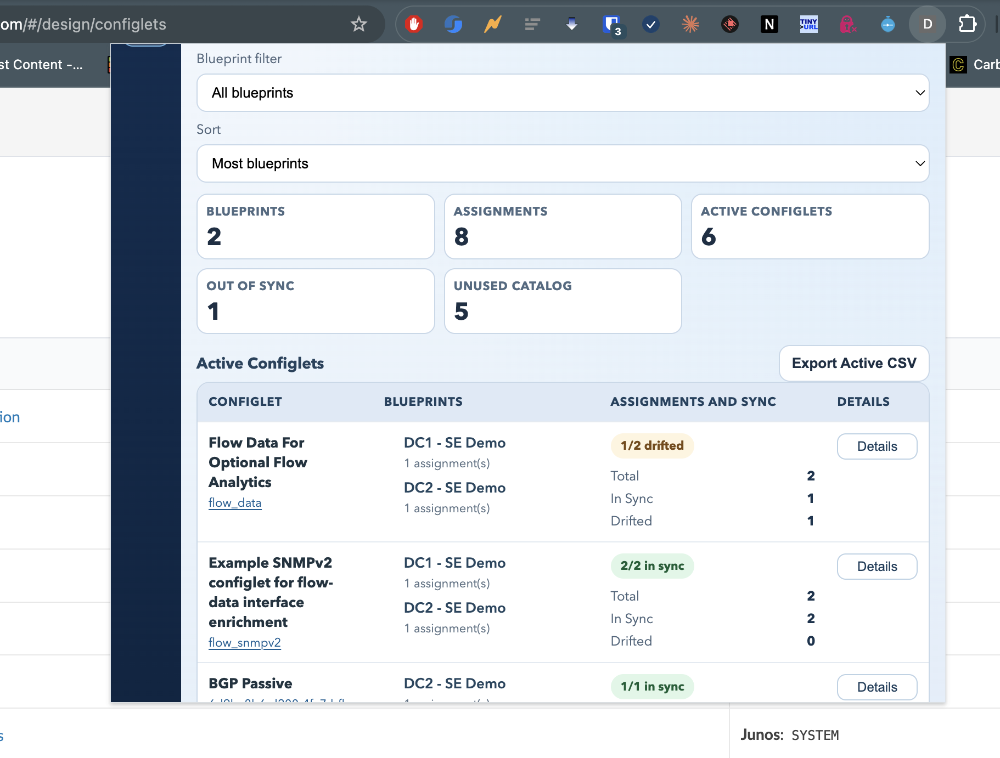
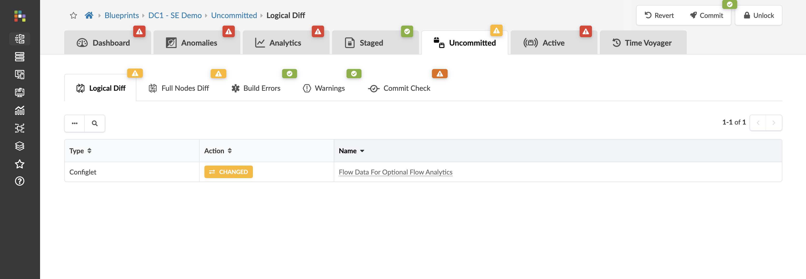
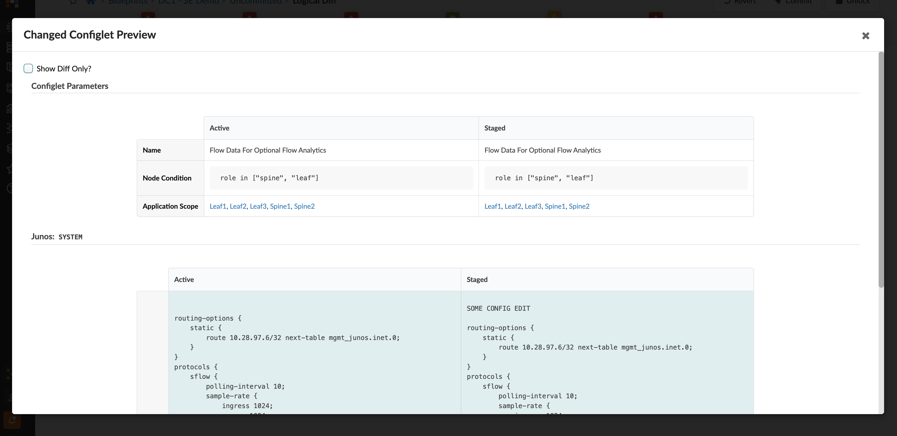

# Data Center Director Tools (Chrome Extension)

This repository contains a zero-configuration Chrome extension for Data Center Director configlet audit, gateway correlation, and scoped VXLAN/VRF stretch operations.

[**⬇ Download Latest Build**](https://github.com/iamjarvs/apstra_chrome_extension/releases/download/main-latest/apstra-extension-main-latest.zip)

## Developer Guide

[Developer and LLM Contributor Guide](docs/DEVELOPER_GUIDE.md)

## Video Overview

[Watch the quick overview video (MP4)](docs/user-guide/videos/CleanShot%202026-08-12%20at%2020.50.37.mp4)

## What It Does

- Detects the active browser tab host automatically.
- Detects whether the active tab looks like a Data Center Director endpoint.
- Uses the active browser session for authenticated API calls.
- Captures bearer/auth headers from outbound /api/ traffic as an auth optimization.
- Runs the Configlets by Blueprint workflow:
  - GET /api/blueprints
  - GET /api/blueprints/{id}/configlets?type=staging (with fallback)
  - GET /api/design/configlets for global catalog comparison
- Displays a popup report with:
  - Home screen with host/token/auth status
  - One row per configlet showing blueprint coverage
  - Drift status (in sync, mixed drift, out of sync)
  - Separate table for unused global catalog configlets
  - Per-blueprint details and diff view against global catalog
  - Per-entry Refresh from Global action for out-of-sync items
  - Search, blueprint filter, sorting, and CSV export
- Runs Gateway Links to correlate inter-blueprint gateway relationships and BGP evidence.
- Runs scope-first VXLAN Stretch to bulk copy missing VXLANs across selected blueprints.
- Runs scope-first VRF Stretch to bulk copy missing routing zones/security zones across selected blueprints.

## Install

This repo auto-builds a ZIP package any time `main` is updated (both direct commits and merged PRs).

[**⬇ Download Latest Build**](https://github.com/iamjarvs/apstra_chrome_extension/releases/download/main-latest/apstra-extension-main-latest.zip)

To install:

1. Open the repository Releases page and select `Main Latest Build`.
2. Download the ZIP asset from that release.

3. Unzip it locally.

4. Open `chrome://extensions`.
5. Enable Developer mode.
6. Click Load unpacked.
7. Select the unzipped folder.

Note: the ZIP is published by GitHub Actions as a release artifact on `main-latest`.

## Scope-First Stretch Workflow

Both VXLAN and VRF tools follow the same operator workflow:

1. Select a blueprint scope (subset or all DCs).
2. Review "Blueprint Stretch Compatibility In Scope".
3. Open planner and select only the rows you want.
4. Run bulk stretch; targets are auto-derived from missing blueprints inside the selected scope.

VRF stretch clones source routing-zone/security-zone values as closely as possible, including VNI/VNID fields where present.

## User Guide / Explainer

### 1. Log in to Data Center Director first

The extension uses your existing browser session. You must already be authenticated in the active Data Center Director tab.

### 2. Open Configlet Audit and review current sync state

Use Configlet Audit to view blueprint coverage, active configlets, sync/drift state, and unused global catalog entries.

### 3. Trigger drift by editing a global catalog configlet

If you edit a configlet in the global design catalog, previously matching blueprint assignments can become out of sync.

### 4. Re-open the extension and inspect out-of-sync entries

After the global edit, refresh the report in the extension. Out-of-sync counts and drift badges update to reflect the change.

### 5. Open Details and review blueprint-level diff

Click Details on the affected row, then expand the diff to compare global catalog content versus blueprint content.

### 6. Click Refresh from Global on the out-of-sync blueprint entry

The refresh action updates the blueprint configlet using a PUT update flow.

- Condition is preserved from the blueprint assignment.
- Label, display_name, and generators are refreshed from the global catalog configlet.

While the request is in-flight, the button is disabled and shows Refreshing.

### 7. Confirm partial or full remediation in the extension

After refresh completes, the report updates. Example: a row can move from 2/2 drifted to 1/2 drifted if one blueprint assignment was refreshed.

### 8. Validate staging changes in Data Center Director

In the target blueprint, open the Uncommitted and Logical Diff views to confirm that the configlet changed and review the exact diff before commit.

## Project Structure

- manifest.json: Extension manifest and permissions.
- src/background.js: Service worker, token capture, API orchestration, refresh workflow.
- src/background.js: Service worker, token capture, API orchestration, gateway correlation, VXLAN stretch, VRF stretch.
- popup/popup.html: Popup layout and views.
- popup/popup.css: Visual design and table/modal styling.
- popup/popup.js: UI state management, filtering, CSV export, details, refresh actions.
