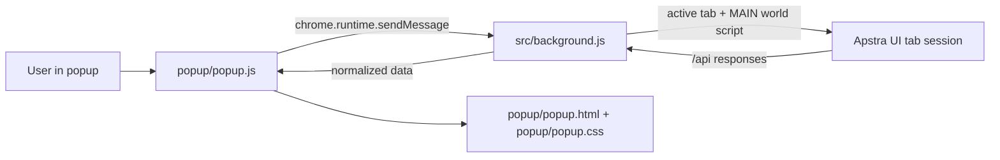

# Developer and LLM Contributor Guide

## Purpose

This guide explains how the extension is structured, how data flows through it, the UI standards to keep, and the safest way to add new features.

Audience:

- Human developers adding features or fixing bugs.
- LLM agents making code updates autonomously.

## High-Level Architecture

The project is a Manifest V3 Chrome extension with a popup UI and a background service worker.

Why this model exists:

- Apstra auth is tied to the browser tab session.
- The background worker executes API calls in the active tab MAIN world when possible.
- The popup only renders UI and user interactions.

## Repository Structure

- manifest.json: MV3 metadata, permissions, popup entry, background worker entry.
- src/background.js: service worker, token/header capture, tab probing, API orchestration, report generation, refresh-from-global action.
- popup/popup.html: popup layout and semantic structure.
- popup/popup.css: design tokens, layout system, table/modal styling, state badges.
- popup/popup.js: UI state management, rendering, filtering/sorting, CSV export, details modal interactions, refresh action.
- docs/user-guide/: end-user guide screenshots and video.
- README.md: install steps and end-user workflow explainer.

## Runtime and Message Contract

The popup talks to background through message types:

- getConnectionStatus
- refreshActiveTabTraffic
- runConfigletsReport
- runGatewayConnectionsReport
- refreshConfigletFromGlobal

Response envelope is always:

- Success: { ok: true, data: ... }
- Error: { ok: false, error: { message, code } }

Background has an explicit timeout guard to avoid hung popup calls.

## How the Core Flow Works

### 1) Connection and auth readiness

Background determines readiness by:

- Active tab exists and is HTTP(S).
- Active tab appears to be Apstra (probe /api/blueprints?limit=1).
- Token or auth headers have been captured from outbound /api traffic.

### 2) Report generation

runConfigletsReport does this:

1. Load all blueprints.
2. Load global configlets.
3. For each blueprint, load configlets (staging endpoint first, fallback endpoint second).
4. Normalize payload shapes.
5. Match each blueprint assignment to global configlet (by id first, then by name).
6. Compute sync state with generator fingerprint comparison.
7. Group rows and compute summary counters.
8. Build unused global catalog rows.

### 3) Refresh out-of-sync entry

refreshConfigletFromGlobal does this:

1. Read blueprint assignment by id.
2. Find matching global configlet (id first, then name).
3. Build PUT payload preserving condition.
4. Replace label, display_name, generators from global catalog.
5. PUT back to /api/blueprints/{blueprint_id}/configlets/{configlet_id}.

### 4) Gateway links correlation report

runGatewayConnectionsReport does this:

1. Load all blueprints.
2. For each blueprint, load remote gateways from /api/blueprints/{id}/remote_gateways.
3. For each blueprint, query /api/blueprints/{id}/ql for protocol sessions and endpoint-to-IP mapping.
4. Keep only routing == bgp sessions and derive endpoint IP pairs per session.
5. Correlate remote gateway gw_ip to other blueprints' local gateway EVPN RD IPs.
6. Mark confidence:
   - high: reciprocal config + shared BGP pair evidence
   - medium: either reciprocal config or shared BGP pair evidence
   - low: config match only
7. Return matched rows + unmatched gateway rows with reasons.

## Data Model Notes

Active table rows are grouped configlet rows with:

- configletName
- globalConfigletId
- blueprints[]
- entries[] (blueprint-level detail records)
- counts (assignmentCount, inSyncCount, outOfSyncCount)

Unused table rows include:

- configletName
- globalConfigletId
- lastUpdatedAt
- catalogText

Gateway report rows include:

- sourceBlueprintId / sourceBlueprintName
- sourceGatewayName / sourceGatewayIp / sourceGatewayAsn
- targetBlueprintId / targetBlueprintName
- targetGatewayName / targetGatewayIp / targetGatewayAsn
- reciprocalConfig
- hasBgpEvidence
- sharedBgpPairs[]
- confidence

The details modal renders blueprint-level cards from row.entries.

## UI Design Standards

Keep these standards for visual consistency:

1. Preserve design tokens in popup/popup.css :root.
2. Keep left navigation collapsed by default (app-shell is-collapsed-nav on load).
3. Preserve three-view model (home + configlets + gateways) unless a new tool is explicitly approved.
4. Keep status badge semantics:
   - status-ready
   - status-pending
   - status-error
5. Every async action must show immediate feedback:
   - disable initiating button
   - change button text when appropriate (example: Refreshing...)
   - restore state on completion/failure
6. Keep table readability priority:
   - sticky headers
   - fixed column widths
   - compact but legible typography
7. Keep modal behavior consistent:
   - close button
   - click outside to close
   - Escape to close
8. Keep links explicit:
   - global configlet link to /#/design/configlets/{id}
   - blueprint configlet page link to /#/blueprints/{id}/staged/catalog/configlets
9. Keep gateway diagram interaction predictable:
   - drag to pan
   - wheel/+/- to zoom
   - reset returns to centered baseline
10. Keep diagram labels short enough to remain inside node boundaries.

## Behavior and Safety Standards

1. Never require raw token display in UI.
2. Keep auth data in extension storage only.
3. Prefer origin-scoped state.
4. Normalize API payloads defensively (field name variants are expected).
5. Maintain pagination safeguards:
   - default page size
   - max page limit
   - graceful fallback when pagination is unsupported
6. Keep heavy comparison work bounded (diff fallback/truncation is intentional).

## How to Add a New Feature Safely

1. Define the user story and target view.
2. Add a new message type in src/background.js handleMessage switch.
3. Implement background business logic first.
4. Reuse existing API wrappers (apiGet/apiPost/apiPut/apiDelete) whenever possible.
5. If Apstra session auth is needed, route through tab API helpers.
6. Add popup state fields in appState only as needed.
7. Add UI controls in popup/popup.html.
8. Wire events in popup/popup.js wireEvents.
9. Render deterministic loading, success, and error states.
10. Update README and user-guide screenshots if user-visible behavior changes.

## Debugging Checklist

1. If popup appears stuck on Checking:
   - verify service worker syntax and startup
   - refresh extension in chrome://extensions
2. If message port closed errors appear:
   - verify background always returns sendResponse
   - confirm no runtime exception before response
3. If API calls fail unexpectedly:
   - confirm active tab is Apstra and authenticated
   - trigger Refresh Token Capture
4. If file:// popup is used for testing:
   - chrome.runtime is unavailable there; this is not a valid runtime test for messaging
5. If refresh action appears to do nothing:
   - verify click handler location (table vs modal)
   - verify async button disabled state and error banner updates
6. If Gateway Links says Unsupported request:
   - popup is newer than active service worker
   - reload the extension in chrome://extensions

## Manual Test Matrix (minimum)

1. Install extension via chrome://extensions and Load unpacked.
2. Verify home status transitions: Checking -> Waiting Token -> Ready.
3. Run Configlet Audit refresh and validate summary counters render.
4. Use search/filter/sort and confirm rows update deterministically.
5. Open details modal and expand diff on out-of-sync entries.
6. Trigger Refresh from Global and verify:
   - button disables immediately
   - report updates after completion
   - out-of-sync counts change as expected
7. Export both CSV files and inspect headers/rows.
8. Validate Apstra Uncommitted/Logical Diff reflects staged configlet changes.
9. Run Gateway Links refresh and validate:
   - matched and unmatched tables populate
   - confidence labels align with evidence
   - diagram renders expected nodes/edges
10. Validate diagram interaction:
   - drag pans
   - mouse wheel and +/- zoom
   - reset re-centers and normalizes zoom

## LLM Contributor Guardrails

1. Do not change endpoint semantics without documenting why.
2. Preserve existing message envelope format.
3. Preserve user-facing terminology unless explicitly requested.
4. Avoid introducing blocking long-running operations in popup thread.
5. Keep feature patches minimal and localized.
6. Run syntax checks after edits.
7. Update docs whenever workflow changes.

## Git and Assets

- MP4 files are tracked via Git LFS.
- Keep screenshots and videos under docs/user-guide.
- Prefer stable, ordered filenames for user-guide assets.

## Quick Reference: Current Endpoints

- GET /api/blueprints
- GET /api/blueprints/{id}/configlets?type=staging
- GET /api/blueprints/{id}/configlets (fallback)
- GET /api/design/configlets
- GET /api/blueprints/{blueprint_id}/configlets/{configlet_id}
- PUT /api/blueprints/{blueprint_id}/configlets/{configlet_id}
- GET /api/blueprints/{blueprint_id}/remote_gateways
- POST /api/blueprints/{blueprint_id}/ql

## Definition of Done for New Features

A feature is done only when all are true:

1. Background logic implemented and reachable through message contract.
2. UI reflects loading/success/error states.
3. No syntax or diagnostics errors.
4. Manual test path validated.
5. README and user/developer docs updated if behavior changed.
